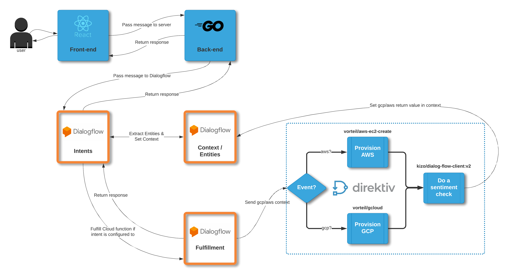

# dialogflow-demo

Following the blog article at:

https://blog.direktiv.io/direktiv-cloud-provisioning-chatbot-part-1-f482bb9ea943

# How to build 
You'll need yarn installed to built the web files, but to build the frontent and server you can just run `make build`.
Build Paths:
* Webfiles: `build/build`
* Server: `build/demo-server`

If you do not want the build the `build` dir, there is a prebuilt version avaliable online on this [repos releases page](https://github.com/vorteil/dialogflow-demo/releases/tag/v1)

# How to run 
The demo-server binary requires a config file path to be set as its first argument. There is a provided example config that you can run with the follow command:
```sh
$ ./build/demo-server example-config/config.toml
```
Make sure that if you run the example-config, you do it with your working directory set to the root of the repo

**PLEASE NOTE: please load your key.json and set your gpc project for gcp access in the example-config directory** 


# Overview of parts

This demo is built from six parts:
* GCP DialogFlow Agent
    * This handles all of the natural language processing, and the flow of the conversation
* Demo Frontend (`/demo-frontend`) : A React frontend chat interface
    * This provides a GUI that takes user input and returns responses from the chat bot
* Demo Server  (`/demo-server`) : A simple Golang api / file server
    * This server has two purposes
        1) Serve the built react frontend files
        2) Host an api server that acts as a client for DialogFlow
* Demo Context App (`/demo-context-app`) : A dirketiv app that is used to push back context to a DialogFlow session
    * The purpose of this app is so that once finished deploying an instance the Direktiv workflow can push the returned state value back to DialogFlow.
    * The returned state value will be set to context named `output`.
* The Direktiv Cloud Event Workflow(`/workflow.yaml`) : The workflow that DialogFlow posts to and that spins up the instance on gcp/aws
* The Dialogflow Cloud Function(`/dialogflow-cloud-function`): This is what dialogflow executes to post its aws and gcp context to direktiv with cloud events

# Diagram of parts
A diagram that shows the parts of this demo interacting.


## More detail on demo parts

#### GCP DialogFlow Agent 
This is responsible for the intent and dialogue of this demo. This is a Google Cloud system/service that can direct you to different messages depending on the set context and input message. Below are some points:
* A DialogFlow agent is built up of many things, but for this demo we are using `entities`, `intents`, `context`, and `fulfilment`.
* Intents: are the intention state of a user. It requires two things to trigger: For the input text to be similar to the `training phrases` and for the input `context` to match. Once an intent is triggered it can do one or all of these things: create `output context`, extract values from user input and save to `entities`, respond to the user with text, or execute a `cloud function`.
    * `training phrases` - These are simply plain text that an `intent` will use to trigger.
        * Example: A simple intent that is triggered when the user says what aws zone he wants to deploy to, and then asks for which machine type to deploy: 
        * Intent: AWS1_User_Input_Zone
        * Input Context: aws, aws_input_zone
        * Output Context: aws, aws_machine_type, selected-provider
        * Entites: aws-deploy-zone
        * Training phrase - [Lets start the machine at ap-northeast-1, I would like to deploy to us-east-1]
        * Response: Alright I'll deploy to  $aws-deploy-zone . Which machine type would you like to deploy?
        * User input: I would like to deploy to us east 1
        * Extracted Entities: $aws-deploy-zone=us-east-1
* Fulfillment: Aside from returning text, an `intent` can execute a `cloud function` when triggered. This cloud function can be anything you want to write using javascript, and also has access to an intents context. This is how in the demo we can do a cloud event POST request to Direktiv from DialogFlow with the context set as the cloud event data.
* Entities: Are values that are configured to extract values from a users input text. They can be a list of values to match against or regex. Think of these as the variables of DialogFlow
    * Example Entity:
    * Name: aws-deploy-zone
    * Values: [{list of all aws zones }]
    * Extra Options: Allow for fuzzy matching
    * So using the example above if the user inputted 'US East 1' it would match with the `aws-deploy-zone` entity with the value `us-east-1`. We can then save this to a context to use in a future intent.
* Context: Every `intent` can have input context that is required to trigger the intent, and output context which is used to control the contexts after this intent. Contexts are very useful and control the flow of `intents` in this demo. Using input and output context, you can control the order of `intent` to give the user a fake sense of a conversation. Contexts are also used to store entities; Think of contexts as also a dictionary where you can store extracted entities. For this demo, all provisioning data/options are saved to the `gcp` and `aws` context.
A context also has a lifetime so it will disappear after a certain amount of `intents` are triggered. However, this can be increased or decreased during any intent.

#### Demo Frontend 
This is a very simple frontend, all it does is act as a client GUI for the  DialogFlow agent. However, it does have one `important` feature: all parts in this demo rely on a `session-id` to communicate and operate on the correct DialogFlow session. This `session-id` can be anything and is created by the frontend in this demo, it is simply a uuid. Once generated, the `session-id` is passed to the `demo-server` `/init` path which will start the demo and save the `session-id` to the DialogFlow `sessionid` context.

#### Demo Server
This server does two things:
##### 1) React Web Server
Serves the built frontent web files. This handler occurs on any path that is not any of the reserved paths. Nice and simple.

##### 2) DialogFlow API

DialogFlow requires certain Google Cloud Platform permissions to communicate with an agent. This API authenicates with a DialogFlow agent and exposes some its functionality so that frontend can use it as a client. 

All routes on this API require a session ID in the path so that it knows what DialogFlow session to communcate with.

The routes are:
* GET - /{sessionID}/dialogFlow/init"
    * This should be the first thing that gets called. It saves the sessionID to DialogFlow as a context and post the message `Hello` to start the conversation with DialogFlow.
* POST - /{sessionID}/dialogFlow/"
    * Posts a message to a DialogFlow session and return the response.
    * Body Example:
    `{ "Message": "hello" }`
* GET - /{sessionID}/context/{context}"
    * Gets a DialogFlow sessions context info / entites
    * `This is only used for debugging`

#### Demo Context App

This application exists solely to savea string value to the context of a DialogFlow session. This is required in order to capture the output from greating a GCP or AWS instance through Direktiv and posting it back to the DialogFlow session.

#### The Direktiv Cloud Event Workflow

This workflow contains a switch state (`id=init`) that will either create an AWS or a GCP instance, depending on the values of `.dialogFlowEvent.gcp` or `.dialogFlowEvent.aws`. Note: `.dialogFlowEvent.gcp` and `.dialogFlowEvent.aws` are created from the `gcp` and `aws` contexts from DialogFlow. The following action state (`id=post-context`) posts the `.return` value from the previous state back to DialogFlow.

#### The Dialogflow Cloud function
This is a gcp cloud function file that runs on node. It has three functons defined:
* decodeAWSOutput
    * This processes the aws output that is returned from direktiv, and creates a response message for the user using those details
* decodeOutput
    * This processes the gcp output that is returned from direktiv, and creates a response message for the user using those details
* customF
    * This function determines whether the context is set to `gcp` or `aws` and makes a POST request to `oz.direktiv.io` to trigger a cloud event. The cloud event data is set to the context value.
    **Important Note:** The cloud function provided has 2 strings: SET_DIRKETIV_NAMESPACE and SET_DIREKTIV_AUTH_TOKEN, you'll need to provide your own details here when deploying.
